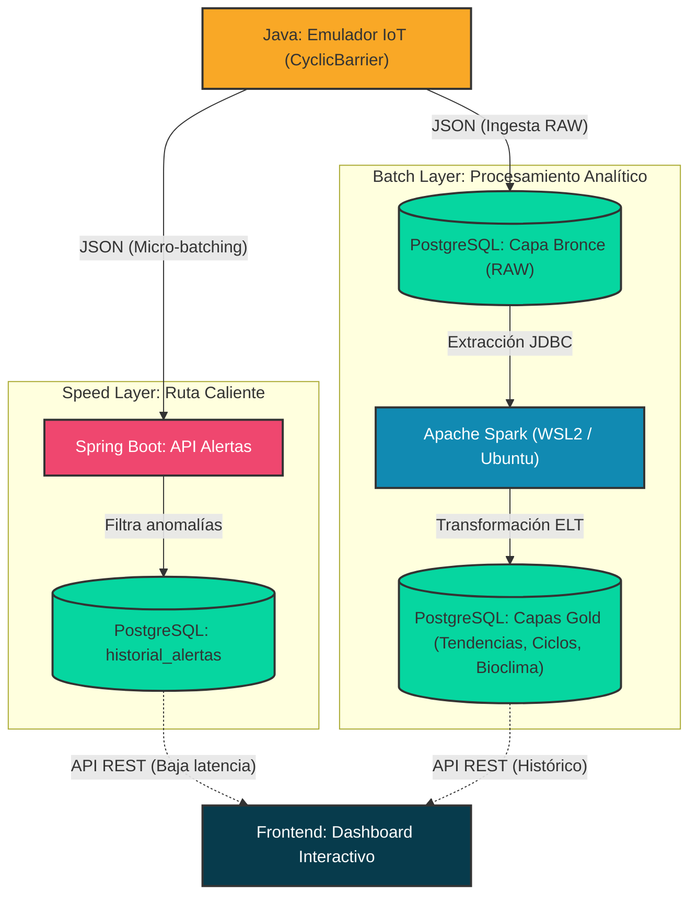

# Arquitectura ELT basasada en patrones Lambda para Monitorización Meteorológica 

¡Hola! Bienvenid@ a mi portfolio. Este repositorio contiene el proyecto principal de mi Trabajo de Fin de Grado (TFG) en Desarrollo de Aplicaciones Multiplataforma, especializado en Big Data e Inteligencia Artificial.

## Enfoque del Proyecto

El sistema gestiona el ciclo de vida completo de los datos generados por una red de sensores meteorológicos simulada, dividiendo el flujo en dos rutas independientes para no comprometer el rendimiento:

* **Speed Layer:** Un microservicio que intercepta las lecturas mediante ingesta por micro-batching. Evalúa umbrales dinámicos en tiempo real (como alertas de helada o rachas de viento) con muy baja latencia.
* **Batch Layer:** Implementa una estrategia ELT (Extract, Load, Transform). Los datos se persisten en raw (Capa Bronce) en PostgreSQL. Posteriormente, procesos orquestados por lotes transforman y segmentan la información en tablas analíticas (Capa Gold) orientadas a la lógica de negocio.

## Diagrama de la Arquitectura

## Stack Tecnológico y Arquitectura de Red

Para priorizar la estabilidad, los servicios operativos y analíticos están separados, utilizando una red híbrida local para simular la comunicación entre distintos nodos:

* **Generación de Datos (Origen):** Java (JDK 21) con control estricto de concurrencia y sincronización multihilo para asegurar que no entren datos corruptos al sistema.
* **Ingesta y Alertas:** Spring Boot (API REST) y Spring Data JPA.
* **Almacenamiento:** PostgreSQL, actuando como repositorio central de datos crudos y refinados.
* **Procesamiento Analítico:** PySpark (Apache Spark). Para replicar un entorno de producción real y evitar la inestabilidad intrínseca de Spark en Windows, este motor se ejecuta de forma nativa sobre **Ubuntu (WSL2)**. La comunicación con la base de datos se realiza a través de un puente JDBC cifrado (SCRAM-SHA-256).

## 📂 Estructura del Repositorio 

Este repositorio actúa como índice. El proyecto está segmentado en submódulos lógicos independientes. Puedes acceder a cada carpeta para consultar las decisiones de diseño y la documentación técnica específica de cada bloque:

* [📁 **Emulador-multihilo**](./Emulador-multihilo): Motor concurrente que simula sensores climáticos en hilos independientes, asegurando la integridad atómica del dato antes de su envío.
* [📁 **Speed-Layer**](./Speed-Layer): Microservicio reactivo que actúa como filtro para interceptar anomalías climáticas.
* [📁 **Batch-Layer**](./Batch-Layer): Capa analítica aislada en Linux/WSL2 que aplica ingeniería de características (cálculo de Wind Chill, variaciones térmicas) y gestiona la memoria de la JVM.
* [📁 **Serving-Layer**](./Serving-Layer): Interfaz web interactiva para la visualización de los datos procesados y el histórico de alertas.

---
*Este proyecto es el resultado de la evolución técnica y la resolución de problemas (como la migración de los procesos de Spark a Ubuntu en WSL2 para garantizar su viabilidad), buscando siempre aprender, adaptarme y asentar buenas prácticas de ingeniería de software.*
